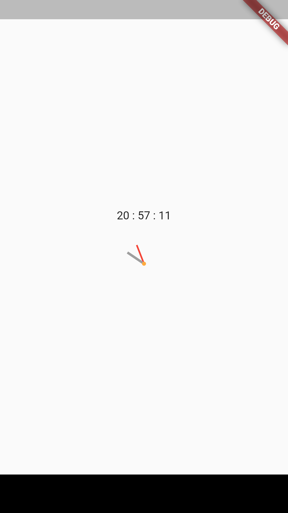

# circular_clock_demo

A project to recreate a circular clock.

Based on this idea:

[Circular Clock interview](https://www.reddit.com/r/FlutterDev/comments/j7g985/interview_questions_for_flutter/)

# idea

After watching a lot of videos using CustomPaint, I decided to use RotationTransition and two basic container to try a different aproach.

Uses the actual date.

# screenshot

